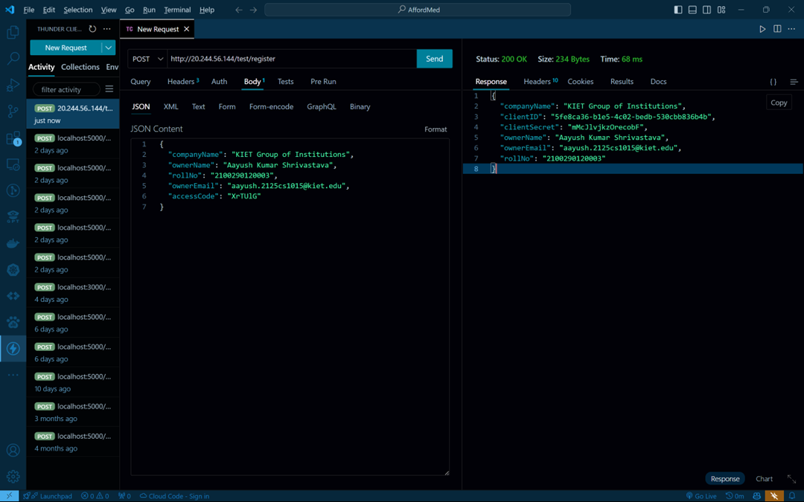
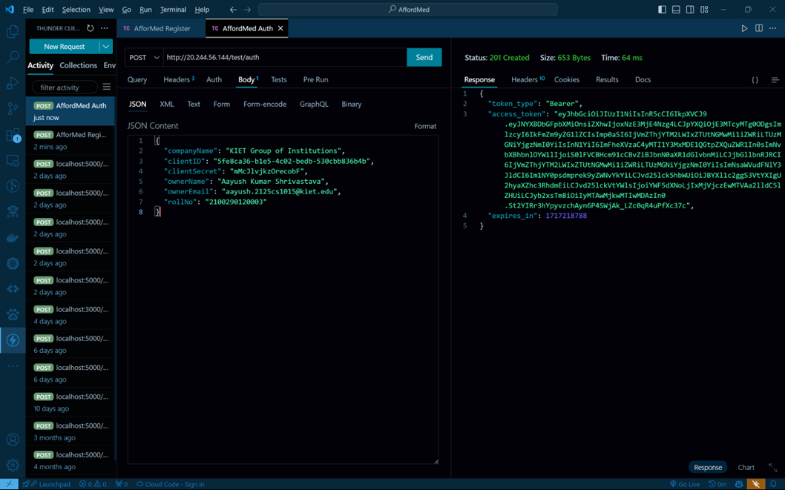
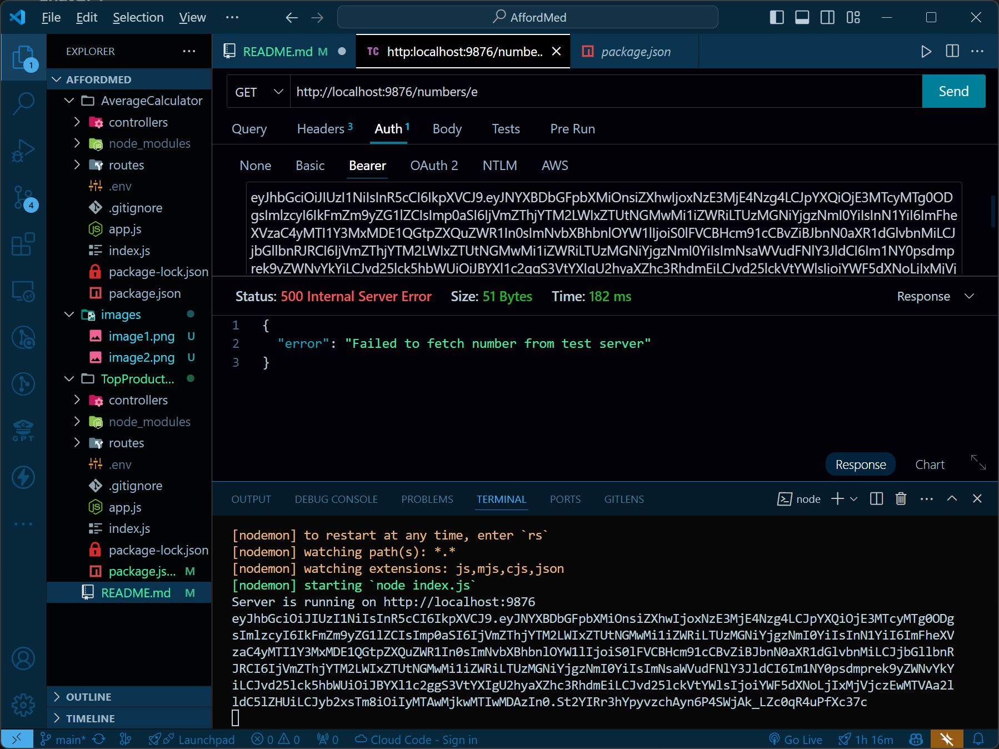

#Average Calculator MicorServices 

### response = {
  "companyName": "KIET Group of Institutions",
  "clientID": "5fe8ca36-b1e5-4c02-bedb-530cbb836b4b",
  "clientSecret": "mMcJlvjkzOrecobF",
  "ownerName": "Aayush Kumar Shrivastava",
  "ownerEmail": "aayush.2125cs1015@kiet.edu",
  "rollNo": "2100290120003"
}

### response = {
  "token_type": "Bearer",
  "access_token": "eyJhbGciOiJIUzI1NiIsInR5cCI6IkpXVCJ9.eyJNYXBDbGFpbXMiOnsiZXhwIjoxNzE3MjE4Nzg4LCJpYXQiOjE3MTcyMTg0ODgsImlzcyI6IkFmZm9yZG1lZCIsImp0aSI6IjVmZThjYTM2LWIxZTUtNGMwMi1iZWRiLTUzMGNiYjgzNmI0YiIsInN1YiI6ImFheXVzaC4yMTI1Y3MxMDE1QGtpZXQuZWR1In0sImNvbXBhbnlOYW1lIjoiS0lFVCBHcm91cCBvZiBJbnN0aXR1dGlvbnMiLCJjbGllbnRJRCI6IjVmZThjYTM2LWIxZTUtNGMwMi1iZWRiLTUzMGNiYjgzNmI0YiIsImNsaWVudFNlY3JldCI6Im1NY0psdmprek9yZWNvYkYiLCJvd25lck5hbWUiOiJBYXl1c2ggS3VtYXIgU2hyaXZhc3RhdmEiLCJvd25lckVtYWlsIjoiYWF5dXNoLjIxMjVjczEwMTVAa2lldC5lZHUiLCJyb2xsTm8iOiIyMTAwMjkwMTIwMDAzIn0.St2YIRr3hYpyvzchAyn6P4SWjAk_LZc0qR4uPfXc37c",
  "expires_in": 1717218788
}

I tries to fetch the response with the access_token by it shows error every time 
### response = {
  "error": "Failed to fetch number from test server"
}

